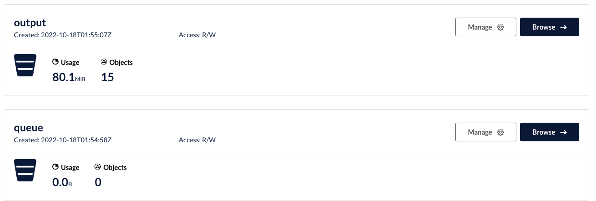

# Music-Separation-using-Kubernetes


Music-Separation-as-a-Service (MSaaS) - A Kubernetes-based distributed system for automatic music track separation.

## Overview

This project implements a scalable microservices architecture that provides a REST API for automatic music separation, allowing users to split songs into their constituent tracks (vocals, drums, bass, etc.). The system is built on Kubernetes and uses state-of-the-art source separation models.

For quick Kubernetes reference, check out the official [kubernetes cheat sheet](https://kubernetes.io/docs/reference/kubectl/cheatsheet/).

## Architecture

The system consists of three main components:

+ **REST Frontend**: Handles API requests for music analysis and track queries. Tasks are queued using Redis for distributed processing. See [rest/README.md](rest/README.md) for implementation details.

+ **Worker Nodes**: Process the music separation requests using Facebook's DEMUCS model. Results are cached in a cloud object store. See [worker/README.md](worker/README.md) for implementation details.

+ **Redis**: Serves as the message broker and caching layer. Configuration details are in [redis/README.md](redis/README.md).

### Source Separation Technology

The core music separation is powered by [DEMUCS](https://github.com/facebookresearch/demucs), Facebook's open-source waveform source separation model. This technology can separate a mixed audio track into its constituent parts (vocals, drums, bass, etc.). The service is designed as a microservice architecture because source separation is computationally intensive, typically taking 3-4x the duration of the input song.

### Deployment Options

The system can be deployed either locally for development or on Google Kubernetes Engine (GKE) for production. Local setup is recommended for development and testing before moving to GKE for production deployment.

### Object Storage System

The project uses MinIO object storage for handling large MP3 files efficiently. Instead of passing audio data through Redis, the system stores both input songs and separated tracks in MinIO buckets. The implementation uses the [MinIO Python SDK](https://min.io/docs/minio/linux/developers/python/API.html) for object storage operations.

The storage structure consists of two main buckets:
- `queue`: Stores incoming MP3 files for processing
- `output`: Stores separated tracks in the format `<songhash>-<track>.mp3`




## Development Notes

### Resource Requirements

DEMUCS has significant memory requirements. When deploying, ensure your nodes have sufficient resources:
- Minimum 6GB RAM per worker node
- Monitor resource usage with `kubectl get nodes` and `kubectl describe node <nodename>`

### Local Development Setup

1. Deploy Redis using the provided `deploy-local-dev.sh` script, which also sets up port forwarding
2. Use Redis lists for work queue management:
   - `lpush` for adding work items
   - `blpop` for processing queue items

### Logging

The project includes a logging system ([logs/log.py](logs/logs.py)) that connects to Redis for monitoring system events. This can be deployed as a separate pod or run locally with port forwarding.

### Port Forwarding for Development

To develop locally while using Kubernetes services:

```bash
kubectl port-forward --address 0.0.0.0 service/redis 6379:6379 &
kubectl port-forward --namespace minio-ns svc/myminio-proj 9000:9000 &
```

This enables local development against Kubernetes-hosted Redis and MinIO services.

### Testing

Two test scripts are provided:
- `short-sample-requests.py`: For local testing with minimal resources
- `sample-requests.py`: For full-scale testing on production infrastructure

## Container Versioning

It's recommended to use version numbers for container images rather than the `latest` tag to ensure proper version control and deployment tracking.
